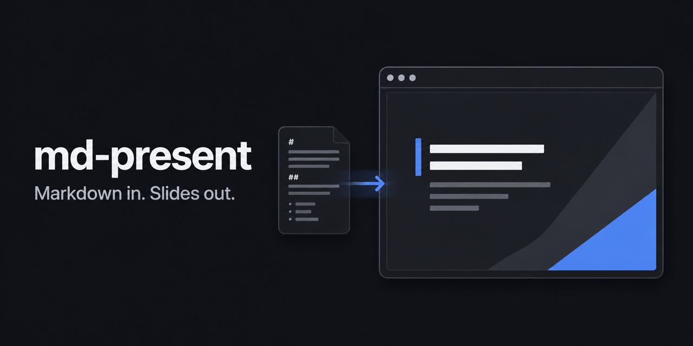

# md-present

`md-present` turns one Markdown file into a clean, local browser presentation. The installed CLI has an embedded interface: no account, configuration, frontend toolchain, or network dependency is required at runtime.

## Install

md-present supports Apple silicon Macs (arm64) only.

### Homebrew

Install the latest release from the md-present tap:

```sh
brew tap timonwd/md-present https://github.com/timonwd/md-present
brew install --cask md-present
```

Upgrade it later with:

```sh
brew upgrade --cask md-present
```

## Usage

```sh
md-present [--no-open] <markdown-file>
```

Slides are separated by a line containing only `---` (surrounding whitespace is allowed). Separators inside fenced code blocks are preserved as code.
Relative image paths are resolved from the Markdown file's directory and embedded in the generated presentation.
GitHub-Flavored Markdown tables, strikethrough, task lists, and automatic links are supported. Fenced code blocks with a recognized language are highlighted locally. A fenced `mermaid` block renders as a diagram using the embedded Mermaid runtime. Raw HTML remains disabled for safety.

```sh
md-present ./example.md
md-present --no-open ./example.md
```

The server listens only on a random `127.0.0.1` port. Without `--no-open`, the default browser opens automatically. Saving the Markdown file or a referenced local image reloads connected presentation tabs and keeps the active slide selected. Invalid intermediate saves leave the last valid presentation visible. Closing the last connected presentation tab normally stops the server after a short grace period; browser crashes and forced termination may prevent a final disconnect from being observed. Use Ctrl+C to stop it explicitly.

## Controls

| Action | Keys |
| --- | --- |
| Next slide | Right, Down, Page Down, Space |
| Previous slide | Left, Up, Page Up |
| First slide | Home |
| Last slide | End |

Use the button in the upper-right corner to enter or exit fullscreen. The active slide is stored in the URL hash. Printing uses one slide per landscape page.

## MVP limitations

This first release intentionally has no custom themes, presenter notes, transitions, or math rendering. Raw HTML in Markdown is not rendered. User-supplied remote image URLs may require network access in the browser; the presentation UI and Mermaid rendering have no runtime network dependency.

## AI agent skill

This repository is distributed as both a Codex and Claude Code plugin. Both use the same plugin package and its single [`SKILL.md`](plugins/md-present/skills/md-present/SKILL.md).

### Codex

Add the repository marketplace, then install the plugin:

```sh
codex plugin marketplace add timonwd/md-present
codex plugin add md-present@md-present
```

Start a new Codex task after installation so the skill is discovered.

### Claude Code

Run these commands inside an interactive Claude Code session:

```text
/plugin marketplace add timonwd/md-present
/plugin install md-present@md-present
```

Run `/reload-plugins` if Claude Code prompts you to activate the newly installed plugin. The skill is available as `/md-present:md-present` and can also be selected automatically when relevant.

### Direct Markdown import

Tools that import skills directly from a Markdown file can download the canonical [`SKILL.md`](plugins/md-present/skills/md-present/SKILL.md).

## License

`md-present` is available under the [MIT License](LICENSE). Third-party
components and their licenses are listed in [THIRD_PARTY_NOTICES](THIRD_PARTY_NOTICES).
