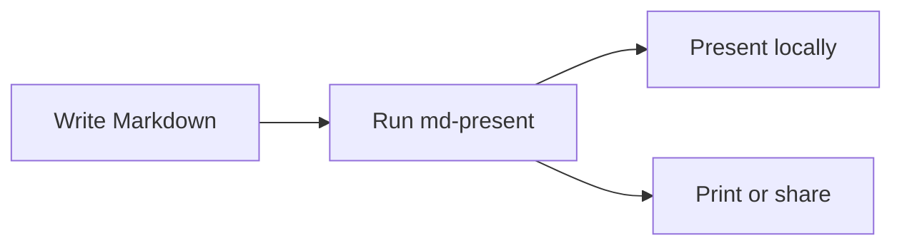
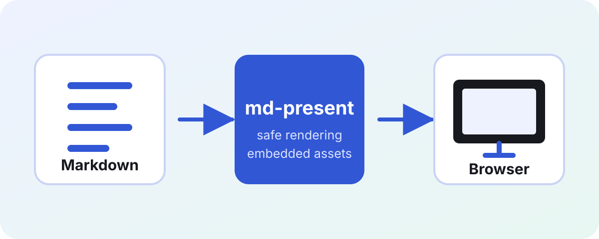

# md-present

Markdown in. Presentation out.

`md-present ./example.md`

---

## Expressive Markdown

### Clear hierarchy, familiar syntax

Write *emphasis*, **strong ideas**, ~~outdated plans~~, and `inline code`.

Use an [explicit link](https://github.com/timonwd/md-present) or let GFM link https://go.dev automatically.

> Keep each slide focused on one idea.

***

Everything stays readable in light and dark mode.

---

## Lists that organize work

- Keep the deck in one Markdown file
  - `---` separates slides but stays intact inside fences
- Present from a private loopback URL

1. Write
2. Run `md-present`
3. Present

- [x] Markdown rendered
- [x] Browser opened locally
- [ ] Your next deck

---

## Tables with alignment

| Capability | Rendering | Ready |
| :--- | :---: | ---: |
| CommonMark | Native | yes |
| GFM extensions | Native | yes |
| Code highlighting | Chroma | yes |
| Mermaid diagrams | Embedded | yes |
| Math | Not included | no |

Left, centered, and right-aligned columns remain CSP-safe.

---

## Code gets presentation-ready color

```go
package main

import "fmt"

func main() {
    fmt.Println("Your deck is ready.")
}
```

---

## Unknown code stays safe

Unknown languages still render as safely escaped plain code:

```custom
<slide>
---
content stays text
</slide>
```

The separator remains part of the fenced block instead of creating another slide.

---

## Diagrams render from fenced Markdown



Mermaid runs from the embedded application bundle, without a CDN or runtime network request.

---

## Local images travel with the deck



Relative images are resolved beside the Markdown file and embedded into the generated page.

---

## Built for presenting

| Action | Keys |
| :--- | :--- |
| Next | `→` `↓` `Page Down` `Space` or click |
| Previous | `←` `↑` `Page Up` |
| First / last | `Home` / `End` |

- The URL hash preserves the active slide
- Saving the deck or a local image reloads connected tabs
- Closing the last tab stops the server after a grace period

---

## One deck, every surface

**Present:** responsive 16:9 slides with automatic light and dark mode.

**Share:** one self-contained local page with embedded images.

**Print:** one landscape slide per page, without the progress counter.

> Small enough to understand. Complete enough to use.

`Ctrl+C` stops the server explicitly.
