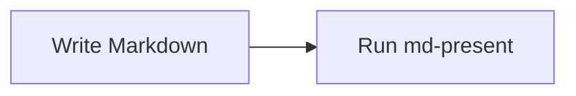
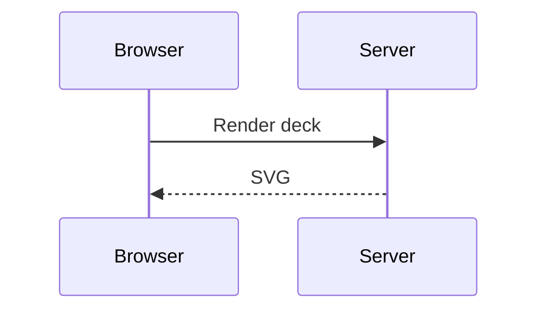
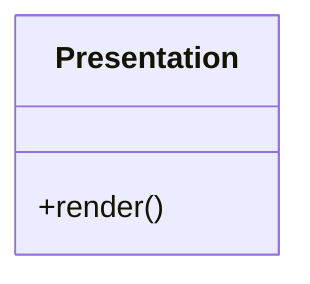
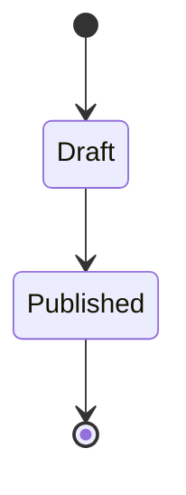
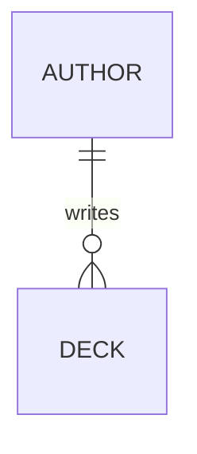
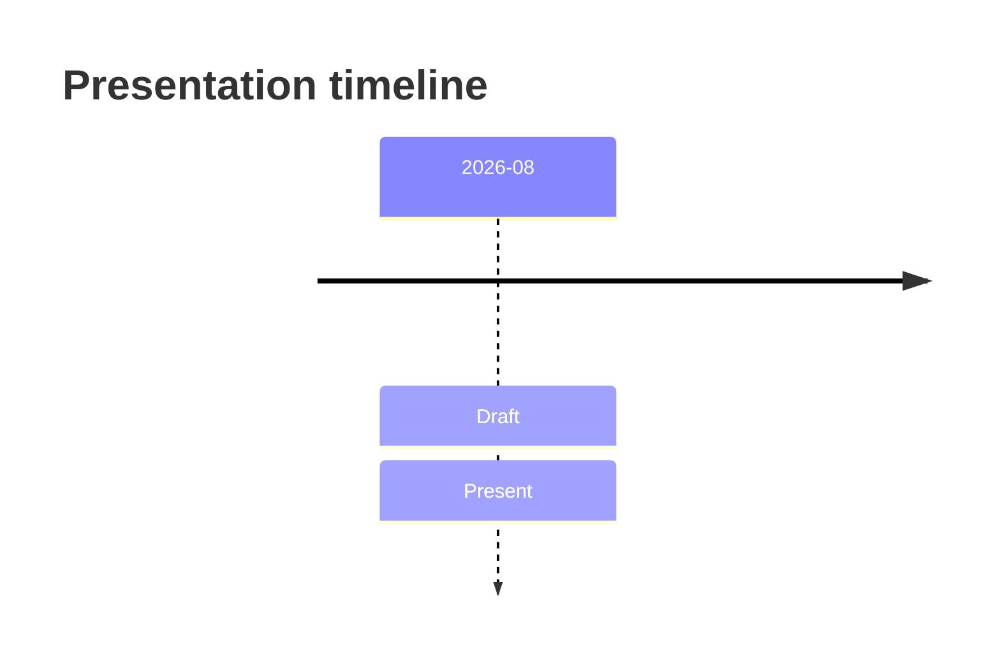
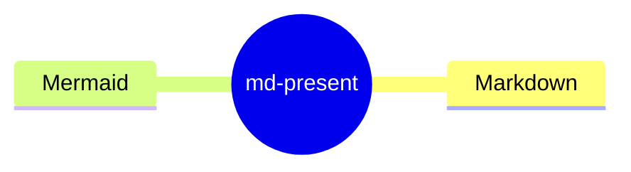
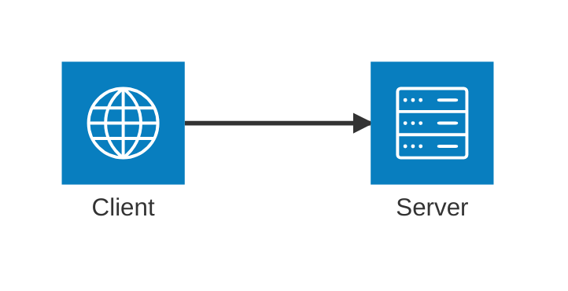
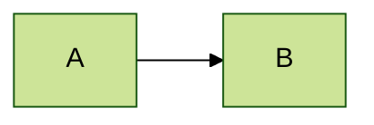

# Mermaid diagram support

This fixture covers the stable diagram baseline and graceful error handling.

---

## Flowchart



---

## Sequence



---

## Class



---

## State



---

## Entity relationship



---

## Timeline



---

## Mind map



---

## Architecture



---

## Invalid syntax remains visible

```mermaid
this is not Mermaid
```

---

## Configuration directives are rejected


