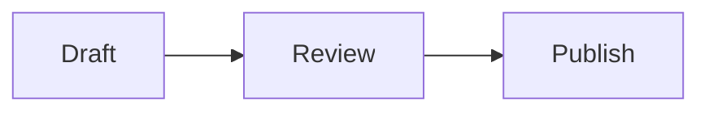

# md-present

md-present turns one Markdown file into a local browser presentation. Keep the Markdown as the editable source of truth; use the browser view to review the structure, not as a separate document format.

## Write presentation-safe Markdown

Use standard Markdown plus GitHub-Flavored Markdown tables, strikethrough, task lists, and automatic links. Add a language to fenced code blocks when syntax highlighting is useful. Raw HTML is intentionally omitted, so do not use it for layout, embeds, or behavior. Unknown or unlabelled code fences remain escaped, plain code rather than failing the deck.

Put `---` on a line by itself to start a slide. Whitespace around it is allowed. Empty content before, after, or between separators does not create a slide; a separator inside a fenced code block remains code.

Start with one idea per slide: a short title and a small number of concise bullets, a focused table, an image, or one diagram. Prefer splitting a dense slide over relying on scrolling. The browser makes oversized slides scrollable and warns about them, but a printed landscape page can clip their overflow.

For example:

```md
# Rollout plan

- Prepare the data
- Test with one team
- Expand after review

---

## Decision points

| Checkpoint | Owner |
| --- | --- |
| Pilot review | Operations |
| Go/no-go | Sponsor |
```

## Add diagrams and media

Use a fenced `mermaid` block for diagrams that clarify flow, sequence, hierarchy, or other relationships. md-present's compatibility baseline is flowcharts, sequence, class, state, entity-relationship, timeline, mind map, and architecture diagrams; other bundled Mermaid types may render but are not guaranteed. Keep diagrams static: Mermaid `init` and `config` directives and interactive callbacks are not supported. Refer to the [Mermaid documentation](https://mermaid.ai/open-source/intro/syntax-reference.html) for diagram syntax.

````md

````

Place local images and videos beside the deck or in a relative subdirectory. md-present resolves those paths from the deck directory and embeds their contents in the generated page. Use normal image Markdown for both:

```md


```

Video destinations ending in `.mp4`, `.m4v`, `.mov`, `.ogv`, `.ogg`, or `.webm` render with browser controls. Prefer local media for offline presentations. Remote media stays network-dependent; absolute paths and media outside the deck directory require an explicit trust confirmation before opening the deck.

## Prepare a deck

1. Keep each slide focused on one idea and sized for a 16:9 stage. Shorten content that would overflow when practical.
2. Keep local media beside the deck or in a relative subdirectory when the presentation must work offline.
3. Review remote, absolute-path, and outside-deck media with the user before running the deck. Do not pass `--allow-external-media` unless the user explicitly approves every listed reference; it bypasses the trust prompt and is suitable only for intentional, reviewed input or non-interactive automation.

Do not introduce or promise user configuration, custom themes beyond automatic light and dark mode, presenter notes, transitions, or math rendering. Fenced Mermaid diagrams and recognized code languages render locally from embedded assets.

## Run the presentation

When the client provides the md-present MCP `present_file` tool, prefer it when
shell execution is unavailable. Pass an absolute Markdown path. The file's
containing directory is the root for relative media. If the tool reports
external media, show the listed references to the user and retry with
`allow_external_media` only after explicit approval.

Use:

```text
md-present [--no-open] [--allow-external-media] <deck.md>
```

Run `md-present --version` first when availability is uncertain.

Use the default command for an interactive presentation. It prints one loopback URL and opens the browser. Use `--no-open` for automated validation; it prints the URL without launching a browser and continues running until signaled.

When a deck includes remote, absolute-path, or outside-deck media, md-present lists the references and asks whether to trust the file before starting. Answer the prompt only when the user has approved those references. For reviewed non-interactive use, pass `--allow-external-media`; otherwise leave the prompt in place.

The server binds only to `127.0.0.1` on a free port. Stop it with Ctrl+C or SIGTERM. Closing the last connected presentation tab normally stops it after a short grace period, but treat that behavior as best-effort.

Saving the Markdown file or referenced local media live-reloads connected tabs. The URL hash preserves the active slide when it still exists; if a save cannot be rendered, the last valid presentation stays visible until the source is valid again.

After a browser lays out the deck, md-present temporarily warns about slides that exceed the regular 16:9 slide area. The warning is viewport-specific: with `--no-open`, no overflow can be reported until a browser opens the printed URL. Oversized slides scroll while normal slides retain their fixed layout. On an oversized slide, the warning collapses to a small indicator that can expand it again.

## Troubleshoot a deck

- If expected slides are merged or split unexpectedly, check that each slide separator contains only `---` apart from surrounding whitespace and that code fences are closed. An unterminated fence continues to the end of the document and produces a terminal warning.
- If a local image or video does not appear, confirm the relative path is resolved from the deck file (not the shell's current directory) and that the file exists. Keep the media in the deck directory or a subdirectory unless the user has reviewed the outside-deck reference.
- If a Mermaid diagram fails, correct its syntax or use a compatibility-baseline diagram type. The slide shows an in-slide alert and escaped source for invalid syntax, unsupported configuration directives, or renderer failures; do not replace it with raw HTML or a Mermaid `init`/`config` directive.
- If a saved change is not visible, keep the server and tab open, save the Markdown or referenced local file again, and check the terminal for a render error or overflow warning. A failed refresh intentionally leaves the last valid presentation visible until the source can render again.

## Validate a deck

1. Confirm every relative image or video exists relative to the deck file.
2. Review remote, absolute-path, and outside-deck media with the user. Keep the interactive trust prompt, or use `--allow-external-media` only after explicit user approval.
3. Start the CLI with `md-present --no-open deck.md`, keep it running, and wait for its single loopback URL line.
4. Request that URL and verify a successful response, the expected slide count, and representative slide content. Check at least one table, code block, diagram, image, or video when the deck contains it.
5. When browser control is available, check the first and last slides, content fit, local media, and diagram render state.
6. Treat an overflow warning as a reason to simplify or split a slide unless scrolling is intentional. For intentional overflow, verify the warning and scroll through all content.
7. Stop the process cleanly after automated checks.

Printing should produce one slide per landscape page. The browser shows a subtle current/total counter during presentation but hides it for print.
